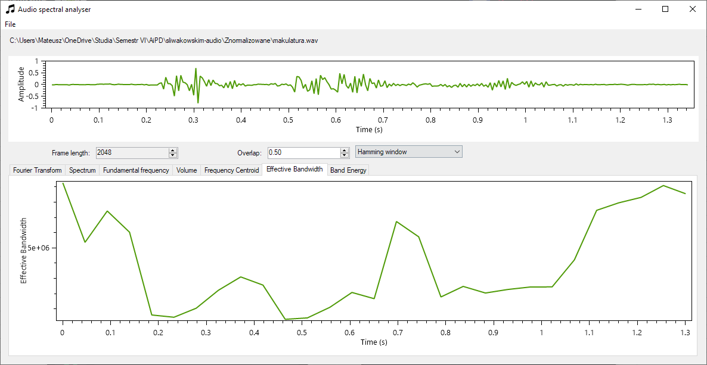

# Audio spectral analyser
Winforms program for spectral audio analysis.

# Implemented plots
* Fast Fourier Transform on whole signal or single frames with window functions
* Spectogram
* Fundamental tone frequency
* Volume 
* Frequency Centroid
* Effective Bandwidth
* Band Energy

# Technology stack
* Window system - WinForms
* Audio loading - NAudio
* Audio analysis - MathNet.Numerics
* Plotting - OxyPlot

# Notes
* As it was university course the report is written in polish
* I noticed some bugs with audio files with high sample rates, they're probably caused by me misinterpreting NAudio reader's data.
